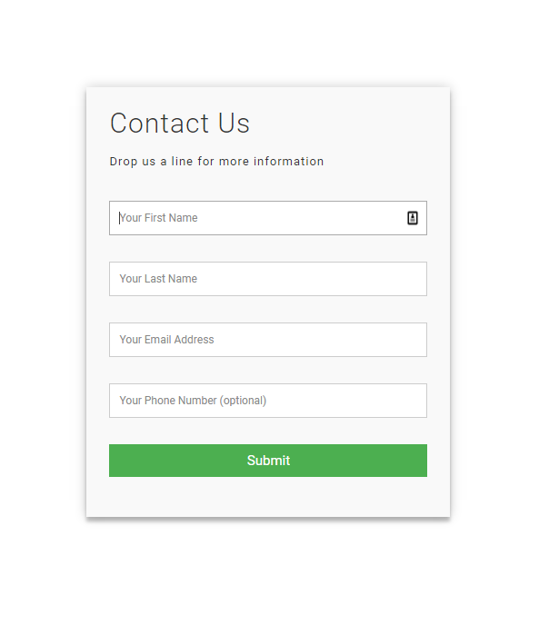

# add a FORM to wordpress that works with Hubspot's CRM.
#### *No Zapier, marketing addons, Paid plugins, or $$ required*
Add contacts via a sign up form easily to wordpress that works with Hubspot's CRM -- leverage Hubspot on the cheap.

## How to use:

Create a Wordpress page and put the HTML code in it.

Use the following plugin to add the CSS to the PAGE

WP Add Custom CSS - https://wordpress.org/plugins/wp-add-custom-css/

Modify the PHP file with a HubSpot API key ---  you need to get Hubspot and create an API key in it to get one.

Zip up this folder with just the PHP code in it and upload it to Wordpress as a plugin. (or deploy to the plugin folder via FTP, etc)

Configure the HTML/PHP to extend the fields capture. Currently it captures first name, last name, email, and optionally, telelphone. Extending it will require some very simple programming.

